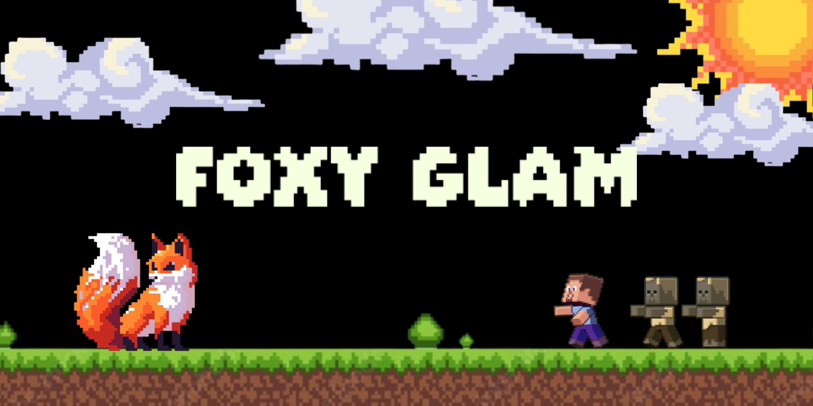

[index.html](https://github.com/user-attachments/files/22964051/index.html)
<!DOCTYPE html>
<html lang="en">
<head>
    <meta charset="UTF-8">
    <meta name="viewport" content="width=device-width, initial-scale=1.0">
    <title>Foxy Glam | Home</title>
    <link rel="stylesheet" href="styles.css">

    <link href="https://fonts.googleapis.com/css2?family=Kalnia:wght@400;600&family=Kapakana&display=swap" rel="stylesheet">
    
    <link rel = "shortcut icon" href = "img/favicon.ico"/>
    <link rel = "icon" type = "image/png" sizes = "32x32" href = "images/" />
    <link rel = "apple-touch-icon" sizes = "180x180" href = "images/apple-touch-icon.png"/>
    <link rel = "icon" sizes = "192x192" href = "images/android-chrome-192.png"/>
</head>
<body>

  <header>
    <nav class="navbar">
      
      <ul class="nav-links">
        <li><a href="index.html" class="active">Home</a></li>
        <li><a href="products.html">Products</a></li>
        <li><a href="cart.html">Cart</a></li>
      </ul>
    </nav>
  </header>

  <section class="banner">
    
  </section>

  <section class="description">
    

      Unleash your inner fox with Foxy Glam, a makeup brand inspired by the charm, confidence, and mystery of the fox.
      Our website offers a stunning collection of cruelty-free cosmetics—from velvety lip tints and shimmering eyeshadows 
      to flawless foundations—all wrapped in sleek, fox-themed packaging.
    

    

      Whether you want a soft, natural look or a bold, fiery glow, Foxy Glam helps you express your beauty fearlessly. 
      Explore our den of makeup must-haves, discover tips from our beauty experts, and let your confidence shine through—
      because every fox deserves to glow.
    

  </section>

  <section class="tagline">
    <h1>Where wild beauty meets elegance</h1>
  </section>

  <footer>
    

      
      
      
    

    
© Foxy Glam Copyright 2025. All Rights Reserved.

  </footer>

</body>
</html>
